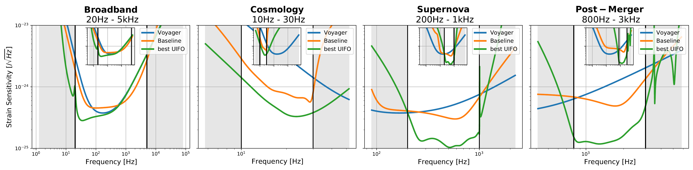

# Gravitational Wave Detector Zoo

**Artificial Scientific Discovery of interferometric Gravitational Wave Detectors**\
_[Mario Krenn](https://mariokrenn.wordpress.com/)†,1, [Yehonathan Drori](https://scholar.google.com/citations?user=OFQrfgYAAAAJ)†,2,3, [Rana X. Adhikarix](https://caltechexperimentalgravity.github.io/)2,3_\
(† = equal contribution)\
1*Max Planck Institute for the Science of Light*\
2*LIGO Laboratory*\
3*California Institute of Technology*

Here we present the technical details of solutions discovered by GWAlgo, and the\
corresponding PyKat and Finesse files for reproducing the solutions. All solutions\
are superior to the LIGO Voyager baseline. As all solutions have superior sensitivity\
compared to the LIGO Voyager baseline (which itself is parametrically optimized),\
it means that the solution not only has better parameter settings, but necessarily\
have new improved topologies.

### Goals of the GW Detector Zoo
**Getting the gravitational wave community involved** to explore and understand the AI-guided solutions,\
and learn new AI-inspired ideas and concepts of high-sensitivity interferometers.
- Every interested researcher is invited to contribute their findings to the Zoo (via Issues or Pull Requests).
- We will keep updating the Zoo with new computational results or conceptualization insights.
  

   

Details on these four superior solutions can be found at
[Broadband](type5/sol00),
[Cosmology](type9/sol00),
[Supernova](type2/sol00) and
[Neutron Star Post-Merger](type8/sol00).

## Solutions types
We have solutions for various frequency regimes, with different noise sources, and different\
geometric constraints. We sort them by the following properties:

**Frequency ranges**
* *Post-Merger*: 800Hz-3000Hz
* *Narrow Post-Merger*: 2700-3000Hz
* *Supernova*: 200-1000Hz
* *Primodial Black Holes*: 10-30Hz
* *Broadband*: 20-5000Hz

**Noise sources**
* *Quantum*: Laser frequency noise, laser intensity noise, quantum noise
* *Quantum+Classical*: Laser frequency noise, laser intensity noise, quantum noise, thermal noise, seismic noise

**Geometry constraints**
* *Large*: UIFO diameters constraint to 4 kilometres
* *Small*: Two 4 kilometer arms, and 400x400 meter filters

## Solutions
The 59 solutions are sorted by type, and then by sensitivity. *Solution0* is the\
best performing one, the last solution has lowest sensitivity while being better\
than the LIGO Voyager baseline.

* **Post-Merger, Quantum+Classical, Large**
   * [Solution 0](solutions/type0/sol00)
* **Narrow Post-Merger, Quantum+Classical, Large**
   * [Solution 0](solutions/type1/sol00)
   * [Solution 1](solutions/type1/sol01)
   * [Solution 2](solutions/type1/sol02)
   * [Solution 3](solutions/type1/sol03)     
* **Supernova, Quantum+Classical, Large**
   * [Solution 0](solutions/type2/sol00)
   * [Solution 1](solutions/type2/sol01)
   * [Solution 2](solutions/type2/sol02)
* **Primodial Black Holes, Quantum+Classical, Large**
   * [Solution 0](solutions/type3/sol00)
   * [Solution 1](solutions/type3/sol01)
   * [Solution 2](solutions/type3/sol02) 
* **Broad Band, Quantum+Classical, Large**
   * [Solution 0](solutions/type4/sol00)
* **Broad Band, Quantum, Large**
   * [Solution 0](solutions/type5/sol00)
   * [Solution 1](solutions/type5/sol01)
* **Narrow Post-Merger, Quantum, Large**
   * [Solution 0](solutions/type6/sol00)
   * [Solution 1](solutions/type6/sol01)
   * [Solution 2](solutions/type6/sol02)
   * [Solution 3](solutions/type6/sol03)
   * [Solution 4](solutions/type6/sol04)
   * [Solution 5](solutions/type6/sol05)
   * [Solution 6](solutions/type6/sol06)
   * [Solution 7](solutions/type6/sol07)
   * [Solution 8](solutions/type6/sol08)
* **Post-Merger, Quantum, Large**
   * [Solution 0](solutions/type8/sol00)
   * [Solution 1](solutions/type8/sol01)
   * [Solution 2](solutions/type8/sol02)
   * [Solution 3](solutions/type8/sol03)
   * [Solution 4](solutions/type8/sol04)
   * [Solution 5](solutions/type8/sol05)
   * [Solution 6](solutions/type8/sol06)
   * [Solution 7](solutions/type8/sol07)
   * [Solution 8](solutions/type8/sol08)
   * [Solution 9](solutions/type8/sol09)
   * [Solution 10](solutions/type8/sol10)
   * [Solution 11](solutions/type8/sol11)
   * [Solution 12](solutions/type8/sol12)
   * [Solution 13](solutions/type8/sol13)
   * [Solution 14](solutions/type8/sol14)
   * [Solution 15](solutions/type8/sol15)
   * [Solution 16](solutions/type8/sol16)
   * [Solution 17](solutions/type8/sol17)
   * [Solution 18](solutions/type8/sol18)
   * [Solution 19](solutions/type8/sol19)
   * [Solution 20](solutions/type8/sol20)
   * [Solution 21](solutions/type8/sol21)
   * [Solution 22](solutions/type8/sol22)
   * [Solution 23](solutions/type8/sol23)
   * [Solution 24](solutions/type8/sol24)  
* **Primodial Black Holes, Quantum, Large**
   * [Solution 0](solutions/type9/sol00)
   * [Solution 1](solutions/type9/sol01)
   * [Solution 2](solutions/type9/sol02)
   * [Solution 3](solutions/type9/sol03)
   * [Solution 4](solutions/type9/sol04)
   * [Solution 5](solutions/type9/sol05)
   * [Solution 6](solutions/type9/sol06)
* **Broad Band, Quantum, Small**
   * [Solution 0](solutions/type10/sol00)
   * [Solution 1](solutions/type10/sol01)
   * [Solution 2](solutions/type10/sol02)
   * [Solution 3](solutions/type10/sol03)

 ## Software
 - [Plotting the solution .kat files of GWAlgo](software/plotting)
 - [Reproducing the sensitivity plots from a .kat file](software/sensitivity)
