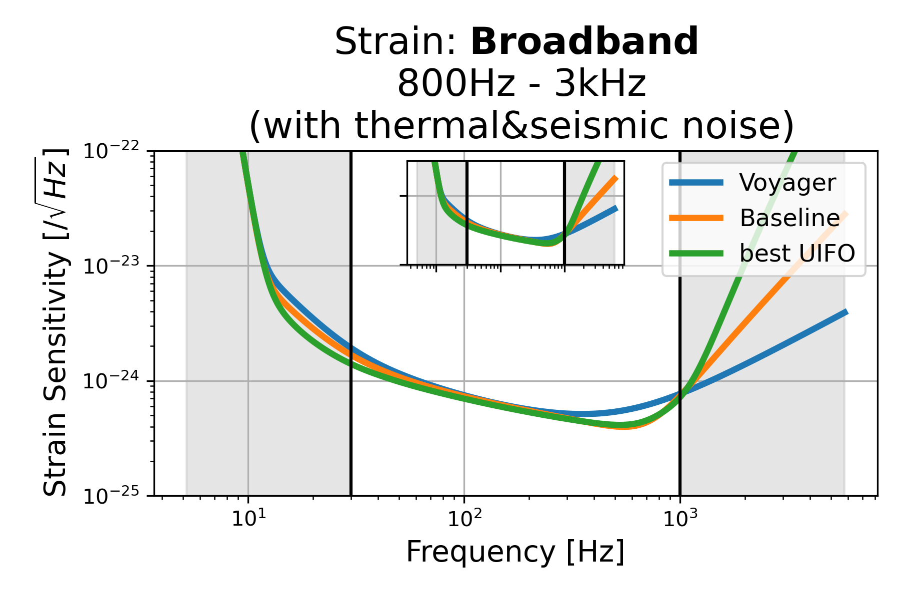
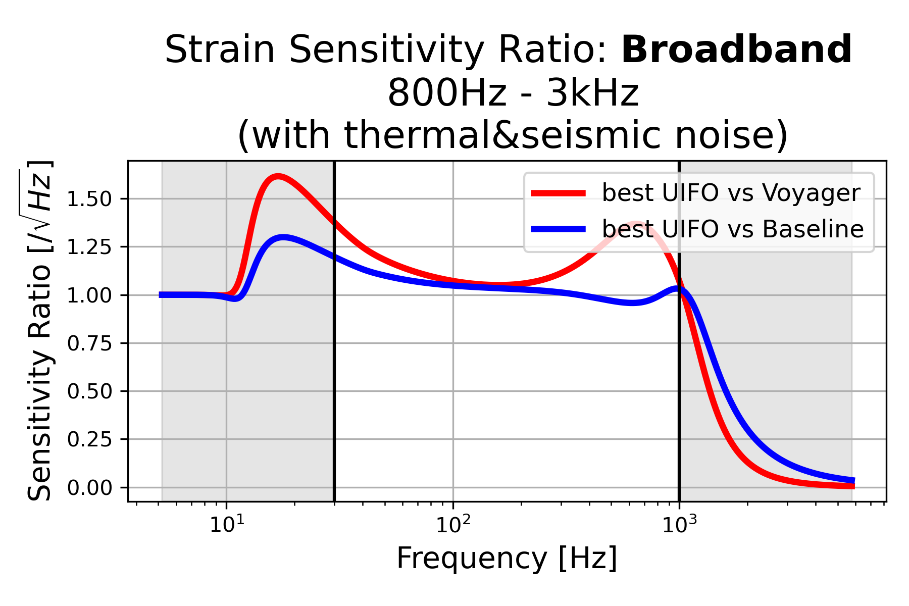
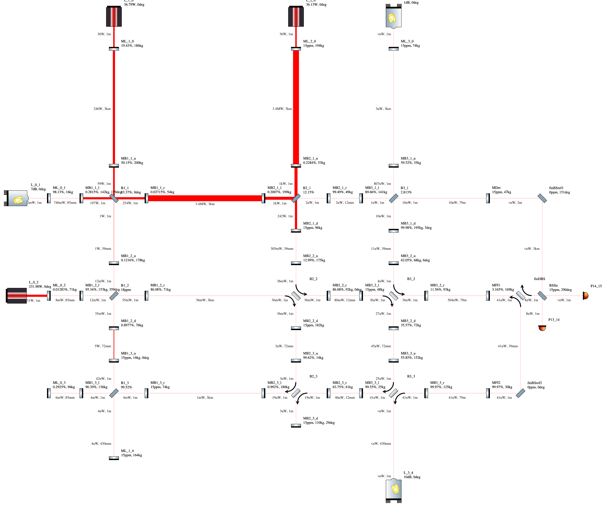
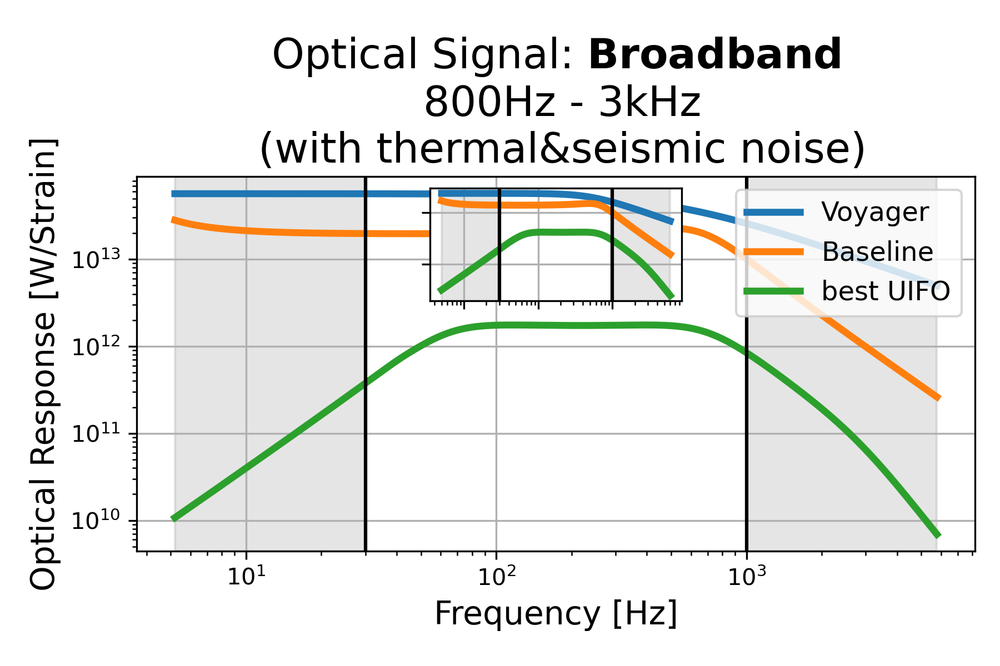
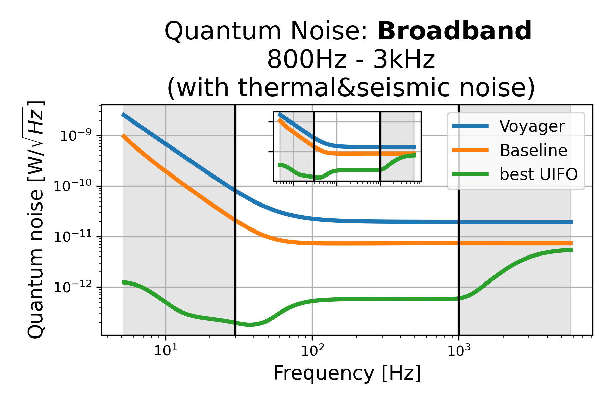

# Post-Merger: 800Hz - 3kHz (with thermal&seismic noise), id=0

## Properties
| Property                              | Data                                                       |
| ------------------------------------- | ----------------------------------------------------------------- |
| Frequency range                   | 800-3000 |
| Considered Noise types                   | quantum, laser frequency, laser intensity, thermal noise, seismic noise |
| Astrophysical Target                   | Neutron Stars |
| Loss               | -6.703 |
|               |  |
| High-Resolution Setup | [PDF](setup.pdf) |
| Full PyKat file       | [KAT](CFGS_0_-6.703_104_8365045200_0_7743147154.txt) |
| Strain CSV            | [CSV](strain.csv) |
| Signal CSV            | [CSV](signal.csv) |
| Noise CSV             | [CSV](noise.csv) |
|               |  |
| Lasers |  3 |
| Squeezers |  3 |
| Mirrors |  47 |
| Beam Splitters |  6 |
| Faraday Isolators |  4 |
| Number of parameters  | 104 |
## Experimental Setup

Note: The experimental setup is not fully optimized and could be significantly simpler.

## Strain Sensitivity
 [Strain CSV](strain.csv)
 [Signal CSV](signal.csv)
 [Noise CSV](noise.csv)

