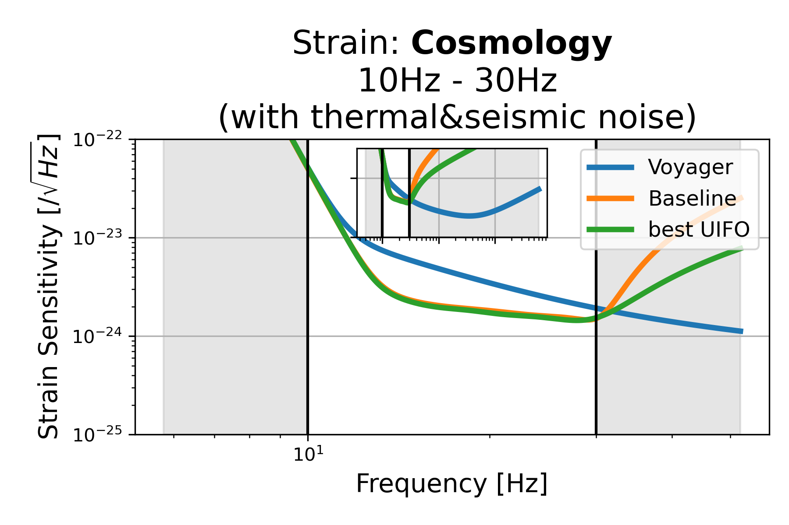
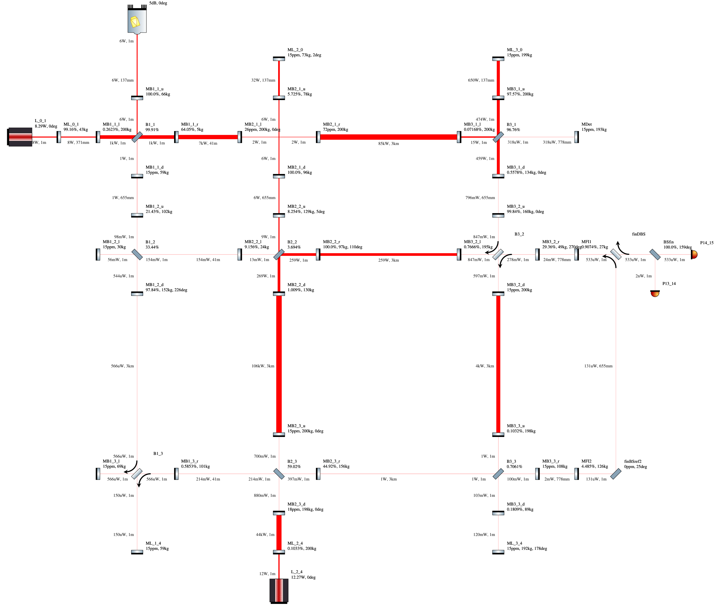
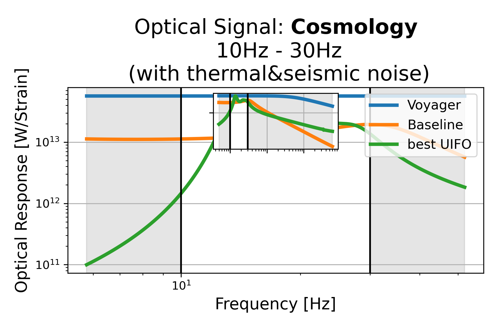
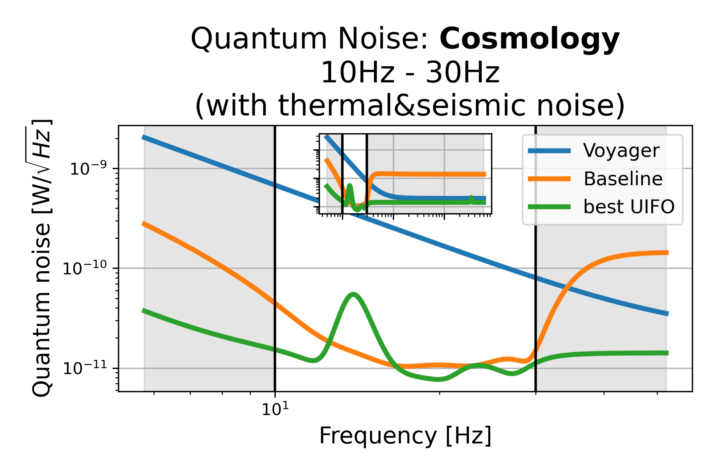

# Cosmology: 10Hz - 30Hz (with thermal&seismic noise), id=1

## Properties
| Property                              | Data                                                       |
| ------------------------------------- | ----------------------------------------------------------------- |
| Frequency range                   | 10-30 |
| Considered Noise types                   | quantum, laser frequency, laser intensity, thermal noise, seismic noise |
| Astrophysical Target                   | Primordial Black Holes, early BH signals |
| Loss               | -25.90 |
|               |  |
| High-Resolution Setup | [PDF](setup.pdf) |
| Full PyKat file       | [KAT](CFGS_3_-25.90_91_9227036463_0_2809967054.txt) |
|               |  |
| Lasers |  2 |
| Squeezers |  1 |
| Mirrors |  46 |
| Beam Splitters |  8 |
| Faraday Isolators |  2 |
| Number of parameters  | 91 |
## Experimental Setup

Note: The experimental setup is not fully optimized and could be significantly simpler.

## Strain Sensitivity

