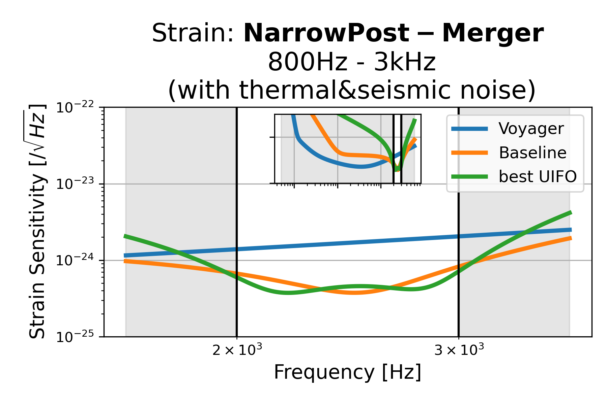
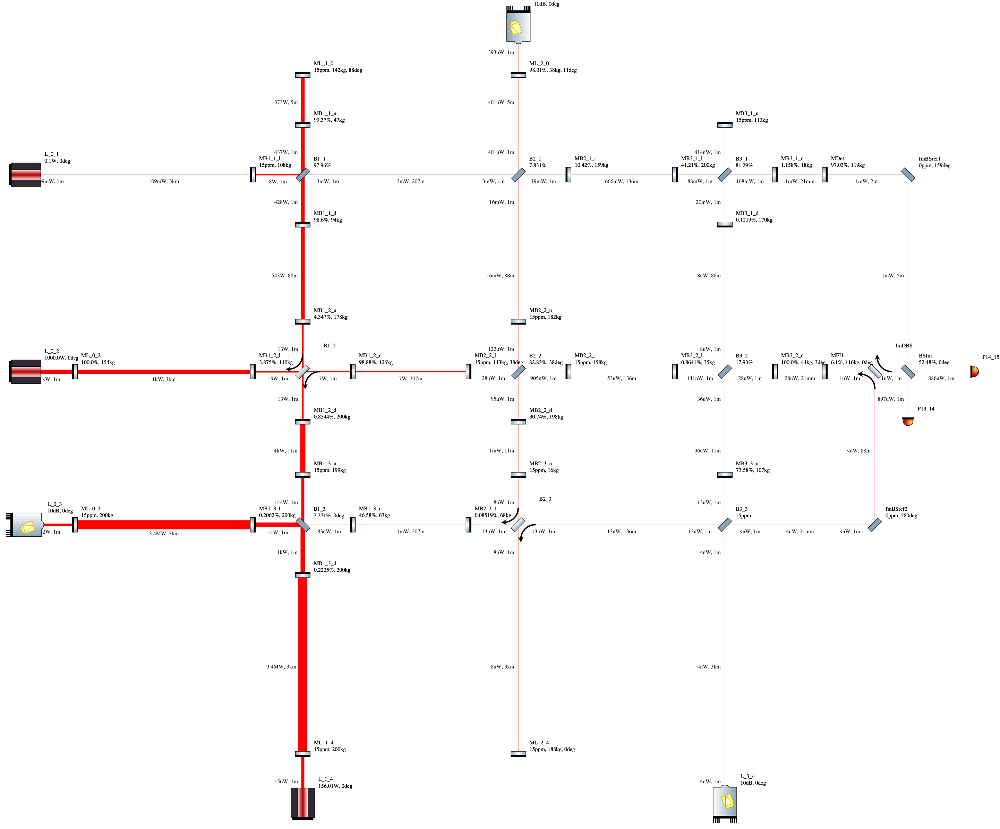
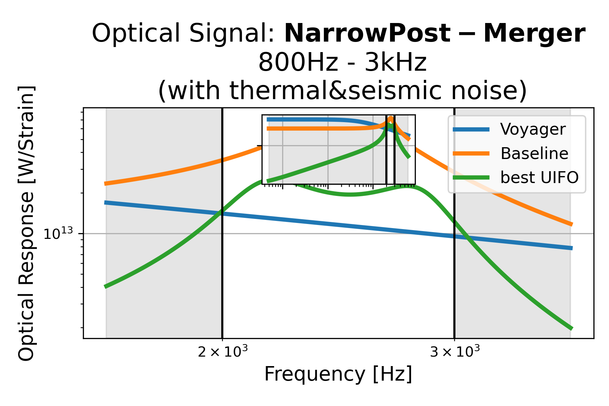
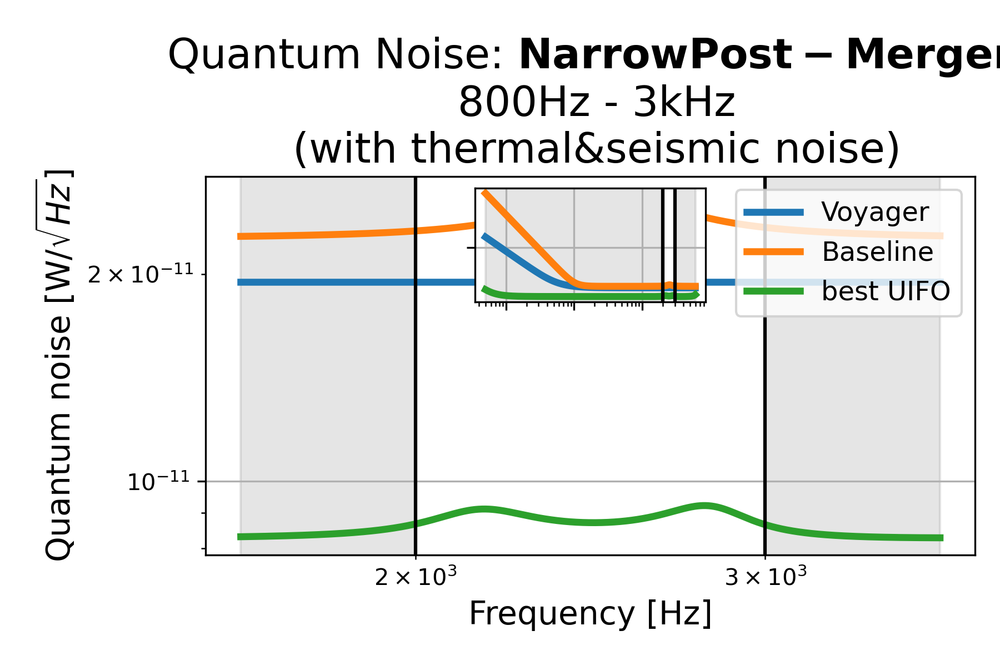

# Narrow Post-Merger: 2kHz - 3kHz (with thermal&seismic noise), id=5

## Properties
| Property                              | Data                                                       |
| ------------------------------------- | ----------------------------------------------------------------- |
| Frequency range                   | 2000-3000 |
| Considered Noise types                   | quantum, laser frequency, laser intensity, thermal noise, seismic noise |
| Astrophysical Target                   | Neutron Stars |
| Loss               | -58.18 |
|               |  |
| High-Resolution Setup | [PDF](setup.pdf) |
| Full PyKat file       | [KAT](CFGS_6_-58.18_86_7520331924_0_2189282746.txt) |
|               |  |
| Lasers |  3 |
| Squeezers |  3 |
| Mirrors |  47 |
| Beam Splitters |  8 |
| Faraday Isolators |  2 |
| Number of parameters  | 86 |
## Experimental Setup

Note: The experimental setup is not fully optimized and could be significantly simpler.

## Strain Sensitivity

