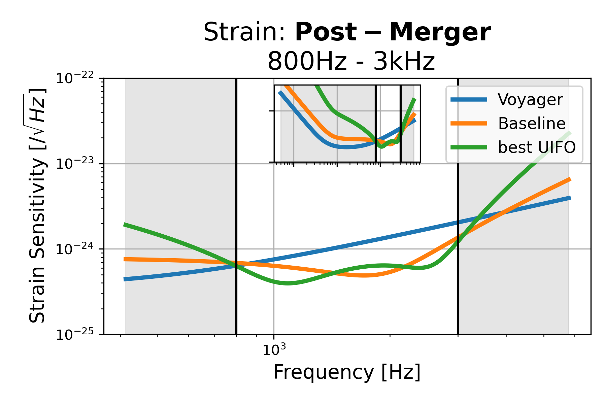
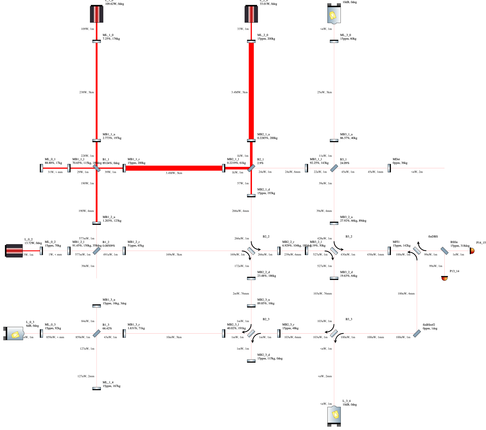
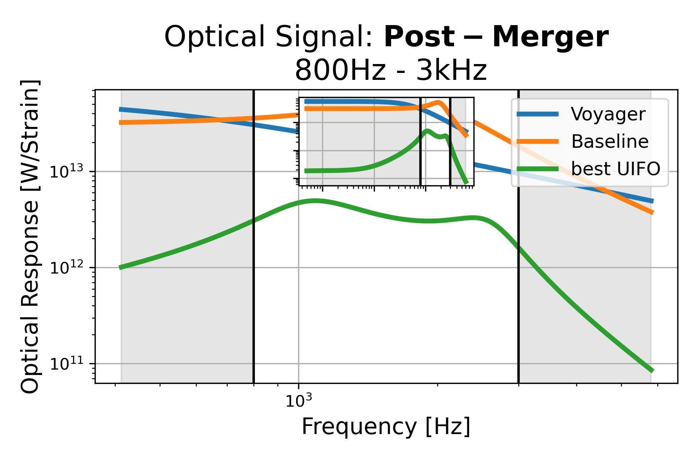
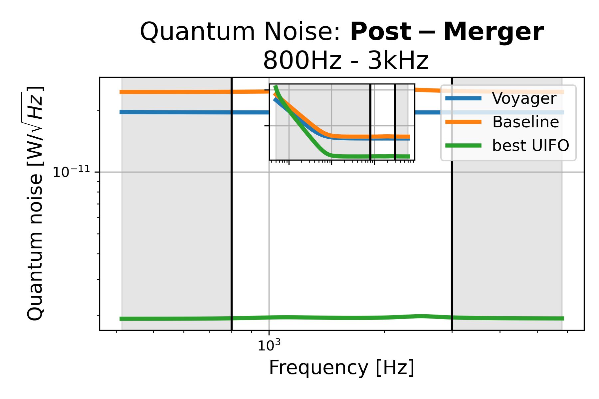

# Post-Merger: 800Hz - 3kHz, id=8

## Properties
| Property                              | Data                                                       |
| ------------------------------------- | ----------------------------------------------------------------- |
| Frequency range                   | 800-3000 |
| Considered Noise types                   | quantum, laser frequency, laser intensity |
| Astrophysical Target                   | Neutron Stars |
| Loss               | -29.92 |
|               |  |
| High-Resolution Setup | [PDF](setup.pdf) |
| Full PyKat file       | [KAT](CFGS_8_-29.92_88_9601563106_0_8589854737.txt) |
|               |  |
| Lasers |  3 |
| Squeezers |  3 |
| Mirrors |  47 |
| Beam Splitters |  6 |
| Faraday Isolators |  4 |
| Number of parameters  | 88 |
## Experimental Setup

Note: The experimental setup is not fully optimized and could be significantly simpler.

## Strain Sensitivity

