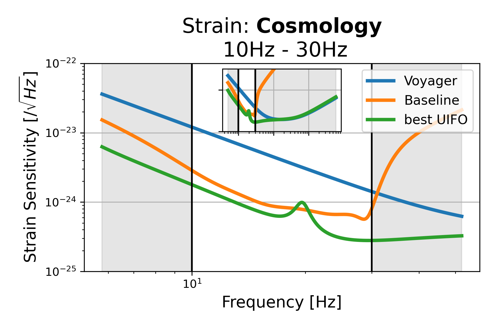
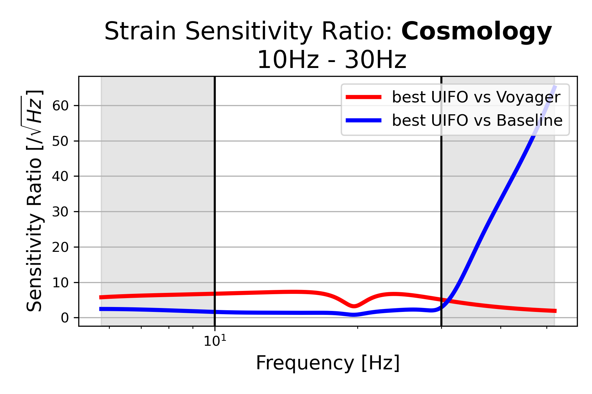
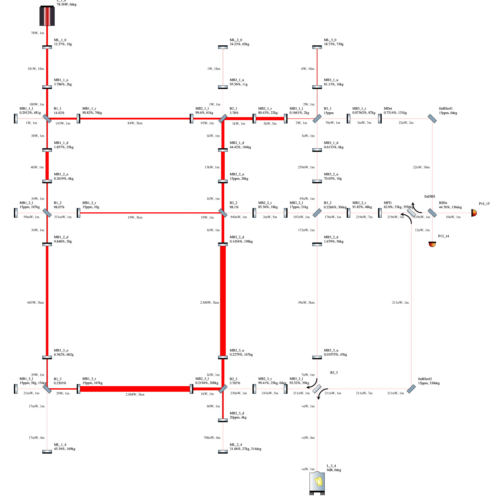
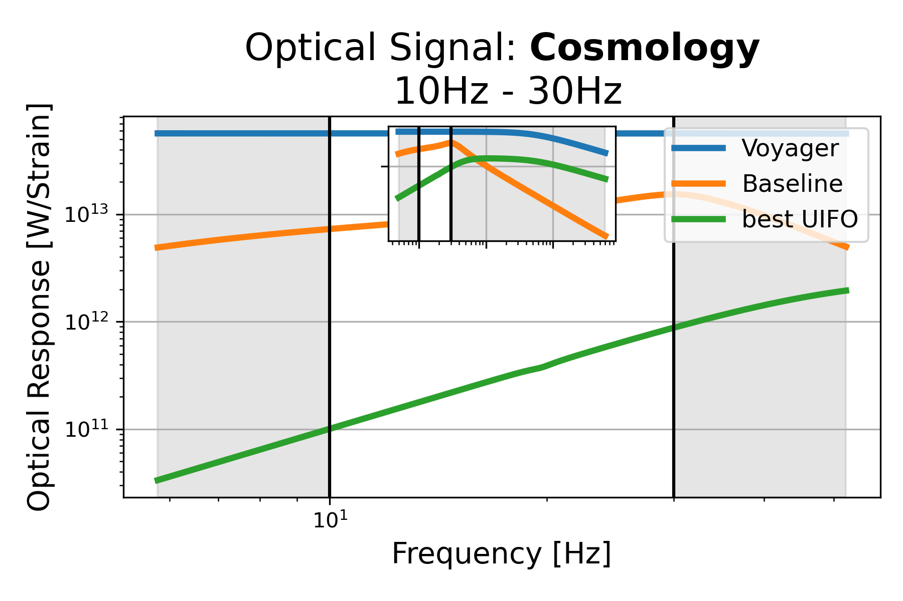
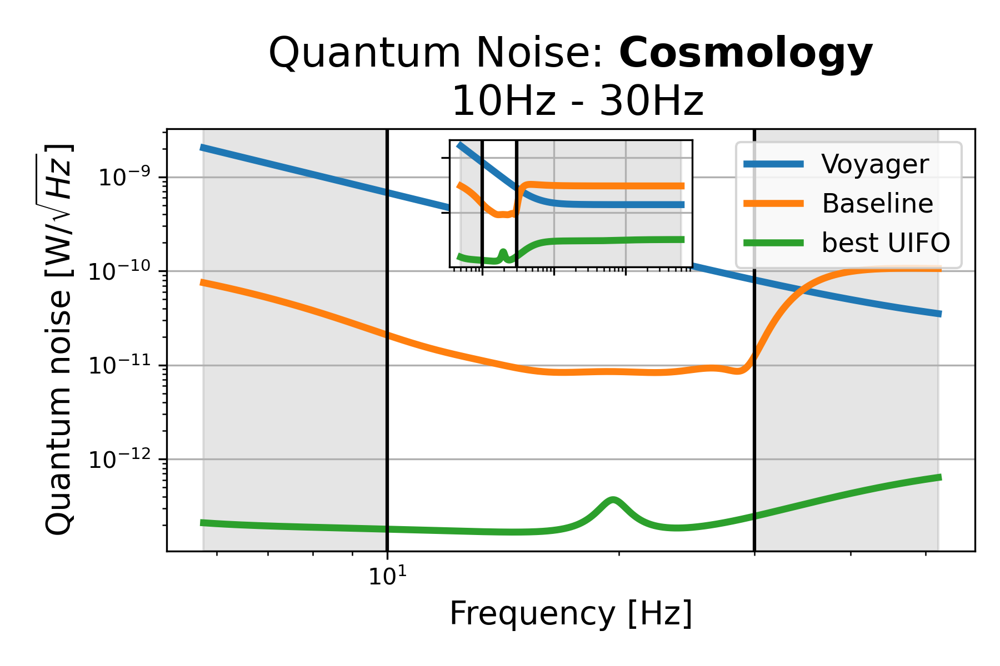

# Cosmology: 10Hz - 30Hz, id=1

## Properties
| Property                              | Data                                                       |
| ------------------------------------- | ----------------------------------------------------------------- |
| Frequency range                   | 10-30 |
| Considered Noise types                   | quantum, laser frequency, laser intensity |
| Astrophysical Target                   | Primordial Black Holes, early BH signals |
| Loss               | -79.84 |
|               |  |
| High-Resolution Setup | [PDF](setup.pdf) |
| Full PyKat file       | [KAT](CFGS_9_-79.84_97_7510412725_0_7717157024.txt) |
| Strain CSV            | [CSV](strain.csv) |
| Signal CSV            | [CSV](signal.csv) |
| Noise CSV             | [CSV](noise.csv) |
|               |  |
| Lasers |  1 |
| Squeezers |  1 |
| Mirrors |  45 |
| Beam Splitters |  9 |
| Faraday Isolators |  1 |
| Number of parameters  | 97 |
## Experimental Setup

Note: The experimental setup is not fully optimized and could be significantly simpler.

## Strain Sensitivity
 [Strain CSV](strain.csv)
 [Signal CSV](signal.csv)
 [Noise CSV](noise.csv)

