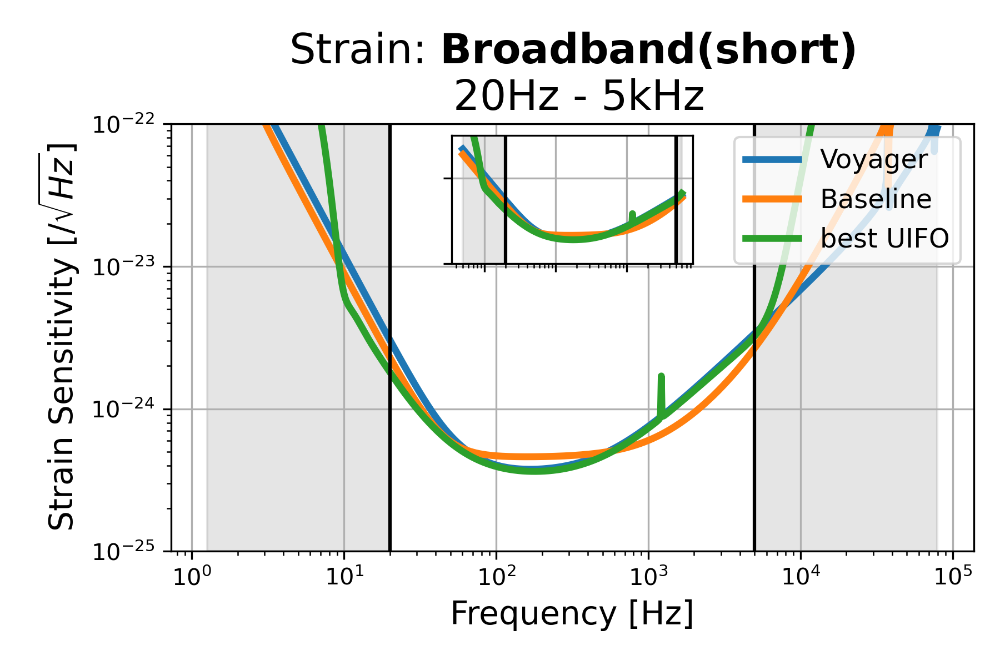
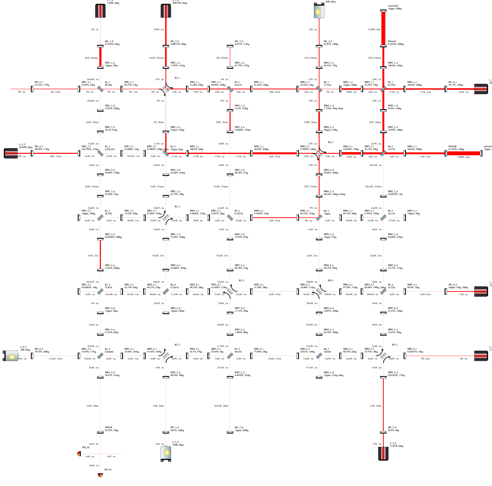
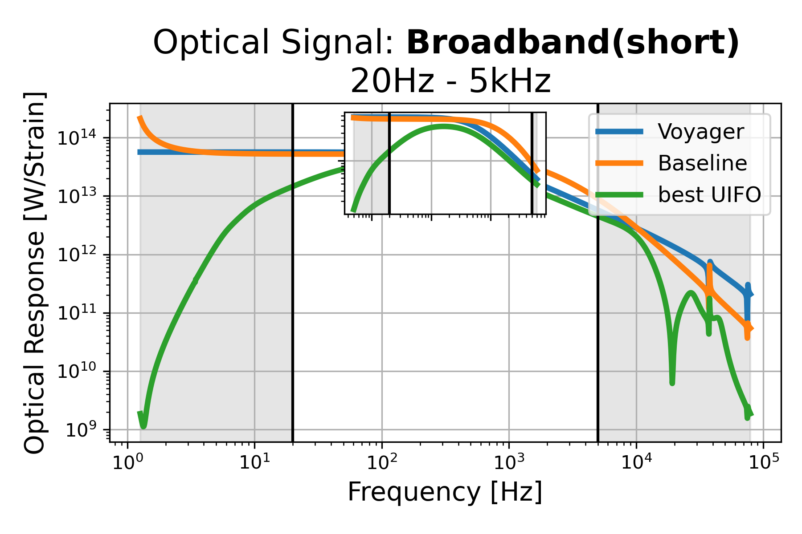
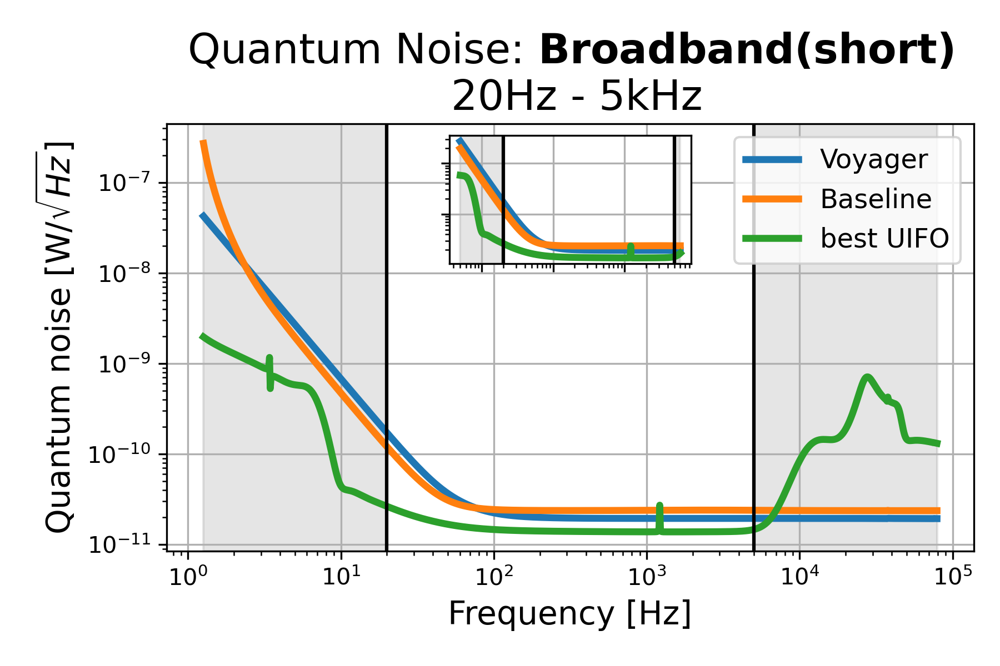

# Broadband (short): 20Hz - 5kHz, id=2

## Properties
| Property                              | Data                                                       |
| ------------------------------------- | ----------------------------------------------------------------- |
| Frequency range                   | 20-5000 |
| Considered Noise types                   | quantum, laser frequency, laser intensity |
| Astrophysical Target                   | Black Hole mergers |
| Loss               | -6.365 |
|               |  |
| High-Resolution Setup | [PDF](setup.pdf) |
| Full PyKat file       | [KAT](CFGS_5_-6.365_256_4785765274_0_5837020766.txt) |
|               |  |
| Lasers |  9 |
| Squeezers |  3 |
| Mirrors |  116 |
| Beam Splitters |  19 |
| Faraday Isolators |  7 |
| Number of parameters  | 256 |
## Experimental Setup

Note: The experimental setup is not fully optimized and could be significantly simpler.

## Strain Sensitivity

