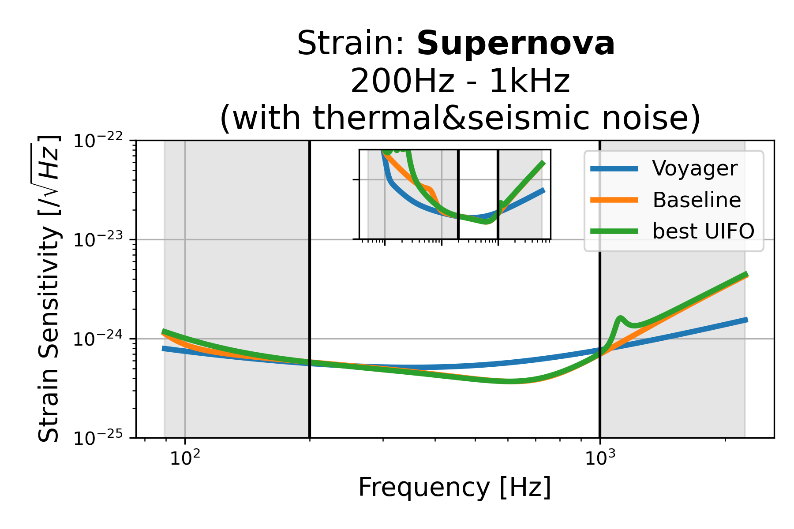
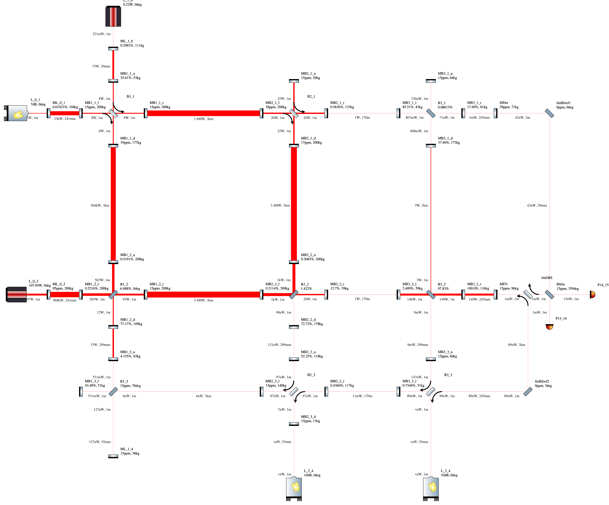
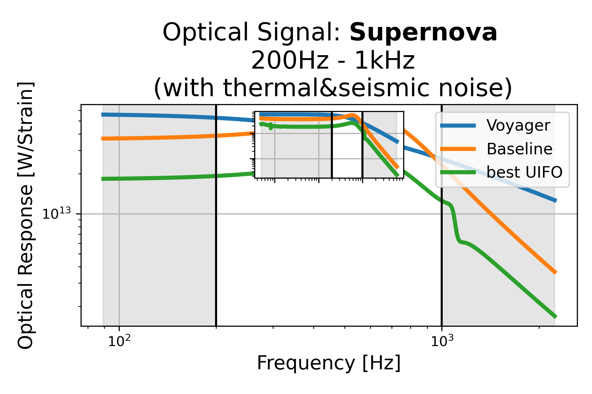
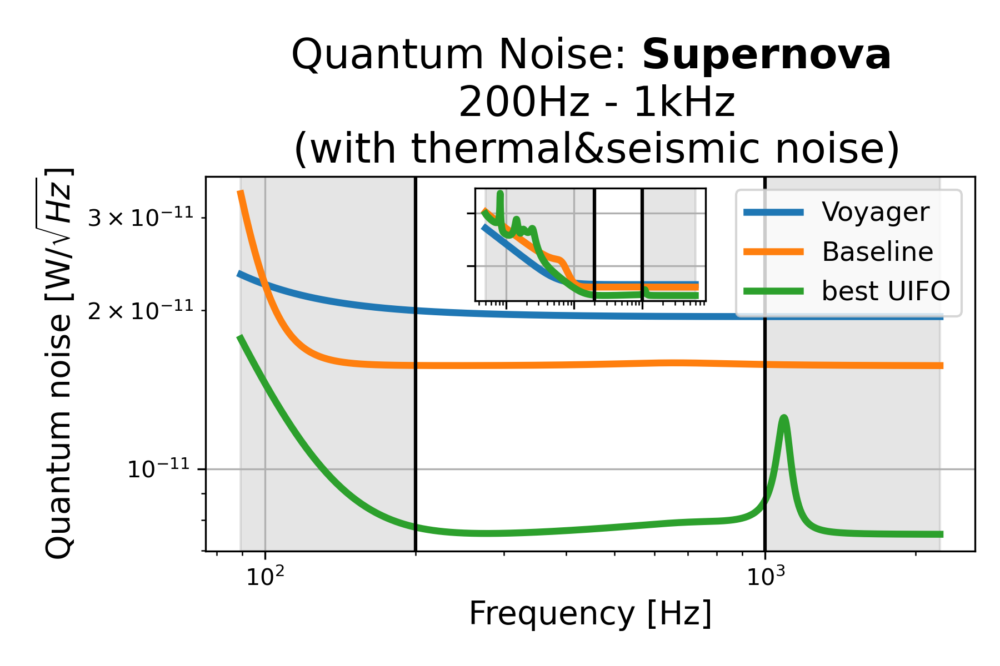

# Supernova: 200Hz - 1kHz (with thermal&seismic noise), id=2

## Properties
| Property                              | Data                                                       |
| ------------------------------------- | ----------------------------------------------------------------- |
| Frequency range                   | 200-1000 |
| Considered Noise types                   | quantum, laser frequency, laser intensity, thermal noise, seismic noise |
| Astrophysical Target                   | Supernova |
| Loss               | -9.233 |
|               |  |
| High-Resolution Setup | [PDF](setup.pdf) |
| Full PyKat file       | [KAT](CFGS_2_-9.233_80_8034890149_0_8321542443.txt) |
|               |  |
| Lasers |  2 |
| Squeezers |  3 |
| Mirrors |  45 |
| Beam Splitters |  6 |
| Faraday Isolators |  4 |
| Number of parameters  | 80 |
## Experimental Setup

Note: The experimental setup is not fully optimized and could be significantly simpler.

## Strain Sensitivity

