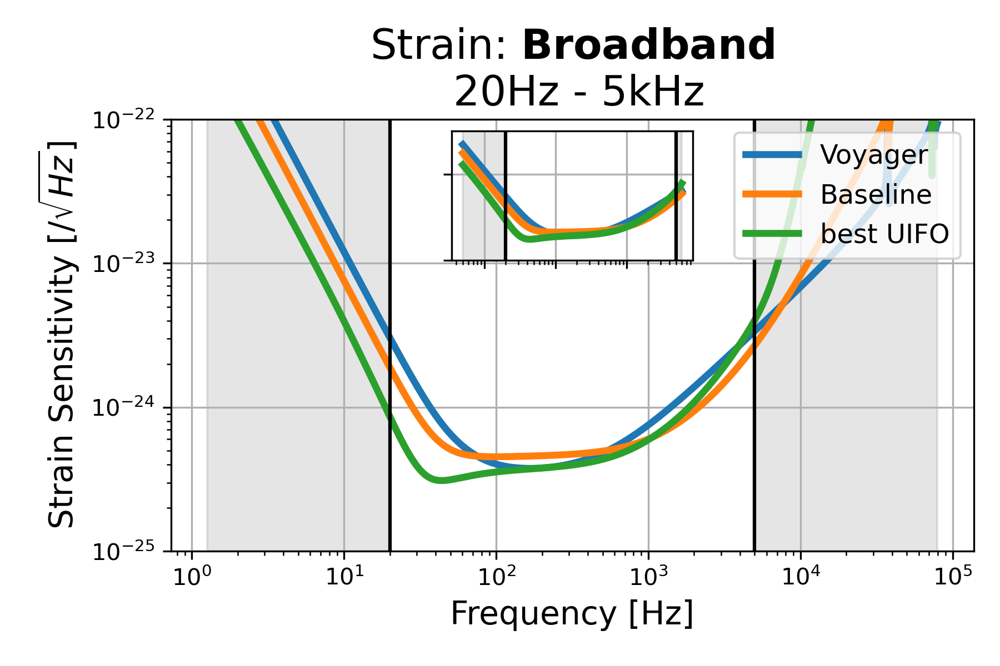
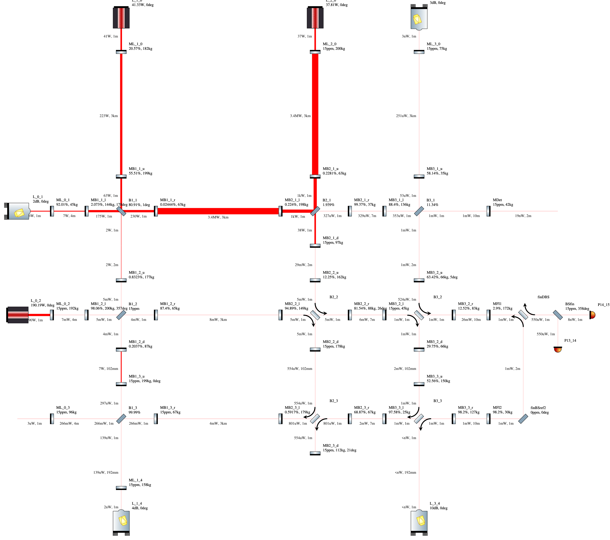
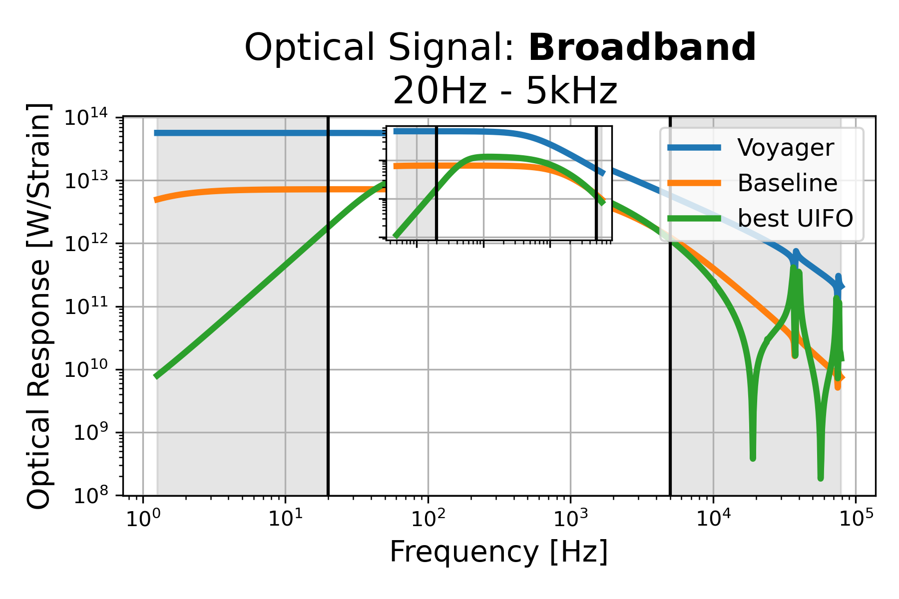
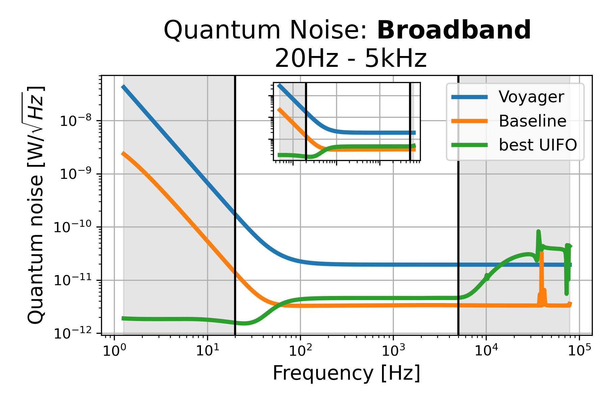

# Broadband: 20Hz - 5kHz, id=1

## Properties
| Property                              | Data                                                       |
| ------------------------------------- | ----------------------------------------------------------------- |
| Frequency range                   | 20-5000 |
| Considered Noise types                   | quantum, laser frequency, laser intensity |
| Astrophysical Target                   | Black Hole mergers |
| Loss               | -18.13 |
|               |  |
| High-Resolution Setup | [PDF](setup.pdf) |
| Full PyKat file       | [KAT](CFGS_5_-18.13_107_3782125183_0_5264056074.txt) |
|               |  |
| Lasers |  3 |
| Squeezers |  5 |
| Mirrors |  47 |
| Beam Splitters |  6 |
| Faraday Isolators |  4 |
| Number of parameters  | 107 |
## Experimental Setup

Note: The experimental setup is not fully optimized and could be significantly simpler.

## Strain Sensitivity

