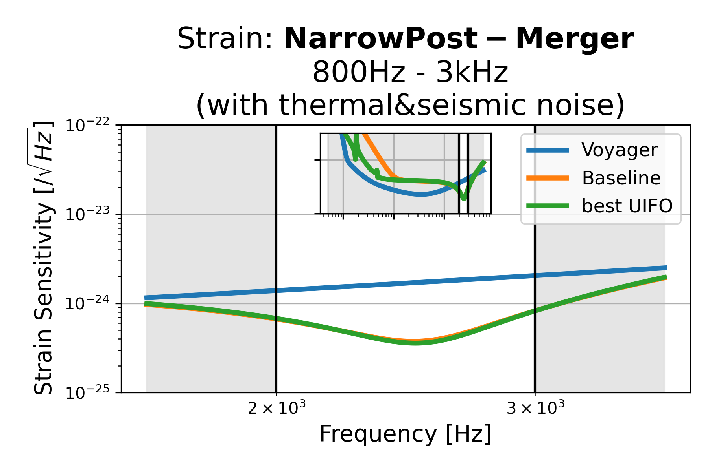
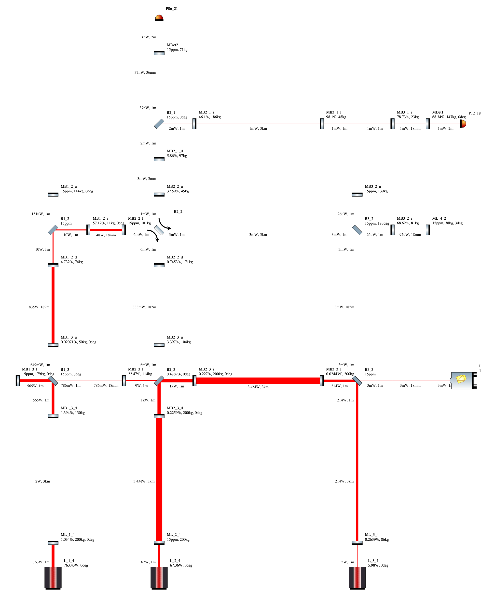
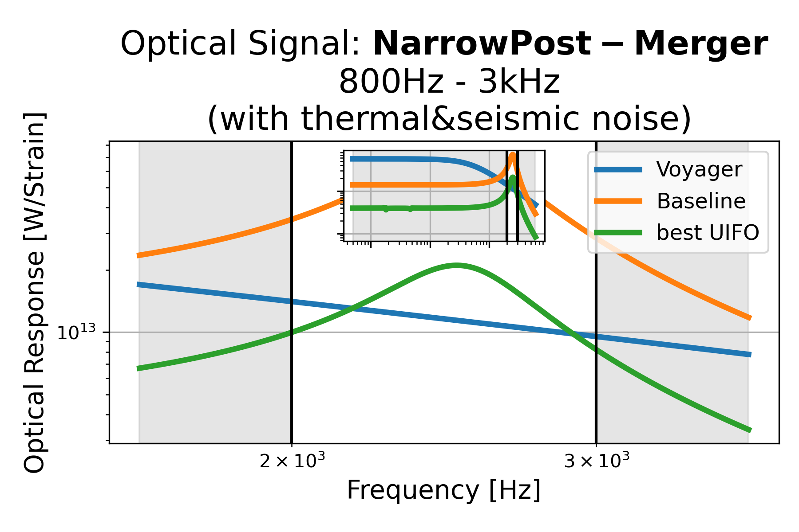
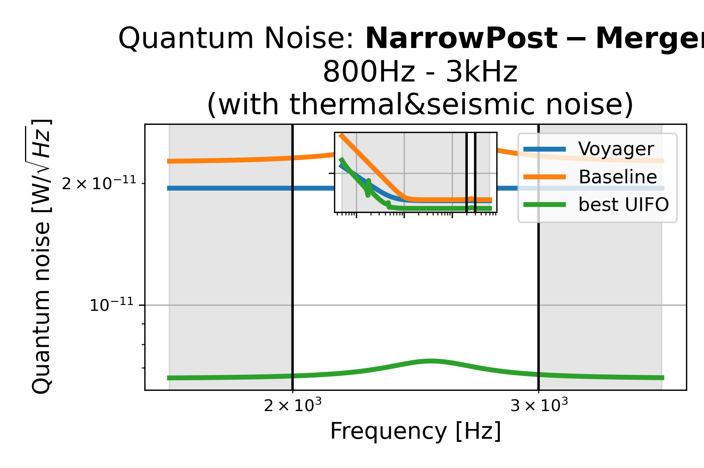

# Narrow Post-Merger: 2kHz - 3kHz (with thermal&seismic noise), id=6

## Properties
| Property                              | Data                                                       |
| ------------------------------------- | ----------------------------------------------------------------- |
| Frequency range                   | 2000-3000 |
| Considered Noise types                   | quantum, laser frequency, laser intensity, thermal noise, seismic noise |
| Astrophysical Target                   | Neutron Stars |
| Loss               | -53.81 |
|               |  |
| High-Resolution Setup | [PDF](setup.pdf) |
| Full PyKat file       | [KAT](CFGS_6_-53.81_70_8487521652_0_8172913181.txt) |
|               |  |
| Lasers |  3 |
| Squeezers |  1 |
| Mirrors |  35 |
| Beam Splitters |  7 |
| Faraday Isolators |  1 |
| Number of parameters  | 70 |
## Experimental Setup

Note: The experimental setup is not fully optimized and could be significantly simpler.

## Strain Sensitivity

