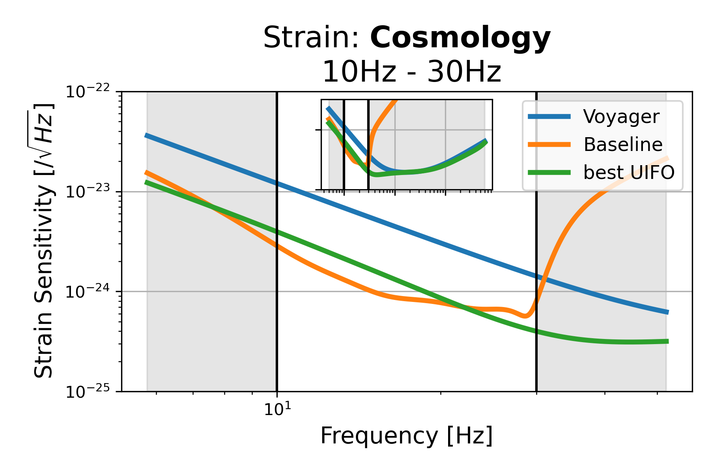
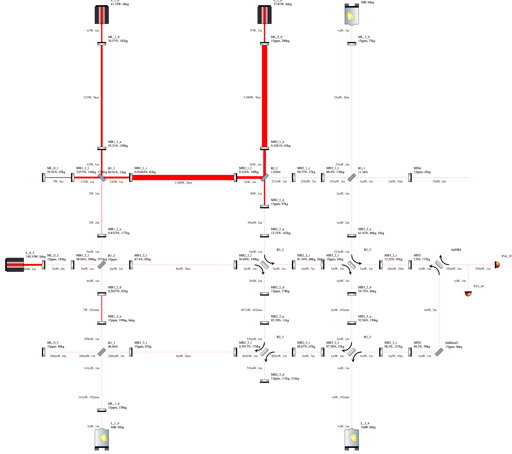
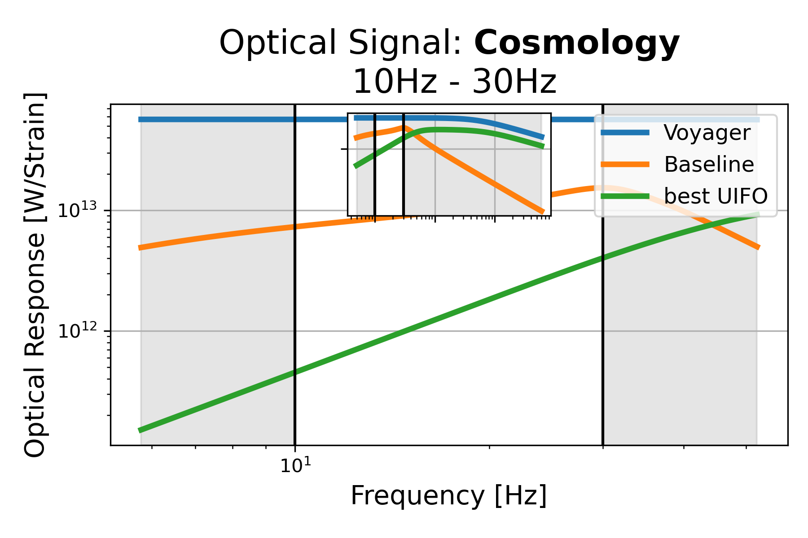
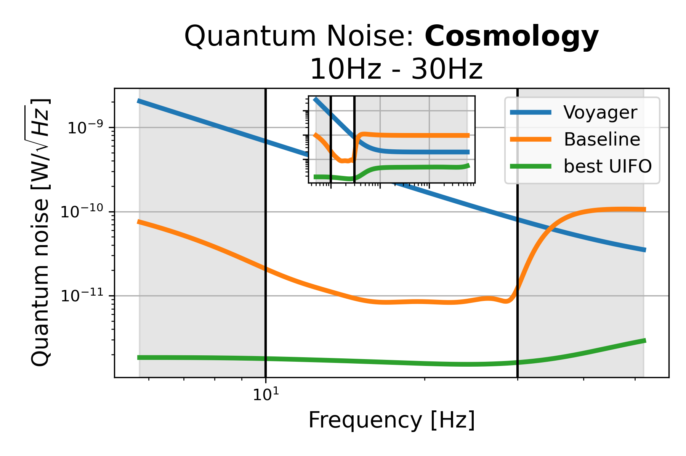

# Cosmology: 10Hz - 30Hz, id=5

## Properties
| Property                              | Data                                                       |
| ------------------------------------- | ----------------------------------------------------------------- |
| Frequency range                   | 10-30 |
| Considered Noise types                   | quantum, laser frequency, laser intensity |
| Astrophysical Target                   | Primordial Black Holes, early BH signals |
| Loss               | -53.61 |
|               |  |
| High-Resolution Setup | [PDF](setup.pdf) |
| Full PyKat file       | [KAT](CFGS_9_-53.61_90_3782125183_0_5264056074.txt) |
|               |  |
| Lasers |  3 |
| Squeezers |  3 |
| Mirrors |  47 |
| Beam Splitters |  6 |
| Faraday Isolators |  4 |
| Number of parameters  | 90 |
## Experimental Setup

Note: The experimental setup is not fully optimized and could be significantly simpler.

## Strain Sensitivity

